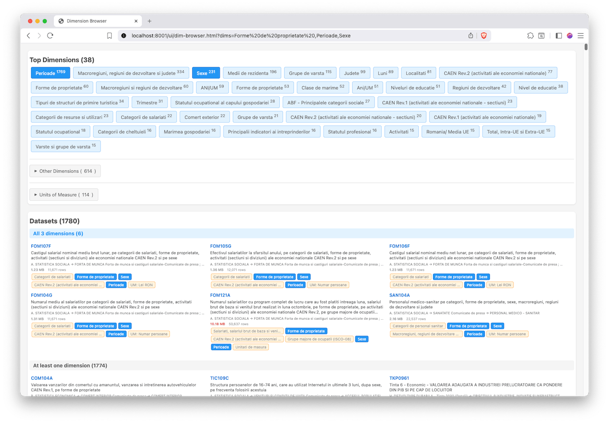

[ins.gov2.ro](https://ins.gov2.ro/) - scrapes data from _TEMPO-Online_ ([statistici.insse.ro](http://statistici.insse.ro:8077/tempo-online))  

_INS Tempo Online but make it nice._

## Scripts

- `1-fetch-context.py` - fetches contexts &rarr; _data/1-indexes/**\<lang\>**/context.csv_ 
- `2-fetch-matrices.py` - fetches datasets &rarr; _data/1-indexes/**\<lang\>**/matrices.csv_
- `3-fetch-metas.py` - reads _matrices.csv_ and fetches dataset meta json &rarr; _data/2-metas/**\<lang\>**/**\<dataset-id\>**.json_
- `3-build-meta-index.py` – 
- `5-varstats-db.py` - parses downloaded dataset meta and saves fields to SQLite.db
- `6-fetch-csv.py` - loops through metas jsons and downloads dataset as csv &rarr; _data/3-datasets/**\<lang\>**/**\<dataset-id\>**.csv_
- `7-data-compactor.py` – compact csv dimensions - replace `opt_label` with `nomItemId` reference
- `0-tempoins-fetch-indexes.py` - fetches ctgs and datasets from prev version: [tempoins](http://statistici.insse.ro/tempoins/) - with archived datasets
- `browser/` - alpha GUI (to be deprecated for [Evidence](https://evidence.dev))
- `query-dimensions.py`

#### Run the initial analysis
python build-dimension-index.py

#### Search for specific terms
python build-dimension-index.py search "Perioade"
python build-dimension-index.py search "Bucuresti" 

#### Use the query helper for advanced searches
python query-dimensions.py summary      # File overview
python query-dimensions.py usage        # Dimension usage stats
python query-dimensions.py search "grade" # Search options
python query-dimensions.py file ZDP1321   # File details

## Profilers

- `data_profiler.py`
- `variable_classifier.py`
- `unit_classifier.py`
- `rules-dictionaries/`
    - `unit_rules.csv`
    - `variable_classification_rules.csv`

## Data

- 1-indexes/<lang>/
    - matrices.csv
    - context.json
    - context.csv
- 2-metas/<lang>/ – jsons
- 3-db
    - tempo-indexes.db
- 4-datasets
- 5-compact-datasets - compact csvs

## Roadmap 
### alpha
- [x] fetch index
- [x] download csvs
- [x] refactor csvs -> db
- [x] dashboard / charts (alpha)
- [x] compact data

### Prepare for UI
- [ ] import into DuckDB / Parquet
- [ ] **split repositories** -> UI (ask 493n7 to look at initial docs, db structure and create clean specs)
    - [ ] api / FastAPI?
    - [ ] front end 

### beta
- [ ] some datasets are not downloaded
    - [x] 30k cells limit alert: _Selectia dvs actuala ar solicita 30600 celule. Datorita limitarilor impuse de o aplicatie web, va rugam sa rafinati cautarea Dvs. pentru a cobori sub pragul de 30000 de celule. Va multumim!_ see comments in [6-fetch-csv.py](6-fetch-csv.py)

### beta
- [x] categorise filters
- [ ] auto charts
- [ ] dataset filtering, charting options

### UI
- [x] filter datasets by dimension
- [x] add context info
- [x] permalinks #variables in url
- [x] combine labels/dimensions
- [x] show dataset preview
- [x] collapse definition
- [ ] tree nav
- [ ] basic stats / charts - per all years, per last year - for localitati normeaza la populatie

see also: [ui/readme.md](ui/readme.md)
 
## Notes

> Atentie! Nomenclatoarele care prezinta doar optiunea "Total" se vor completa automat cu alte optiuni doar daca nomenclatorului anterior i se deselecteaza optiunea "Total" si i se alege o singura alta optiune,

> Important! Unitatile de masura sunt implicit selectate toate pentru a preveni rezultate goale atunci cand se combina cereri incompatibile (spre exemplu, s-ar putea selecta productia de porumb in litri; sau o valoare in ROL dupa denominarea din 2005, etc.).
