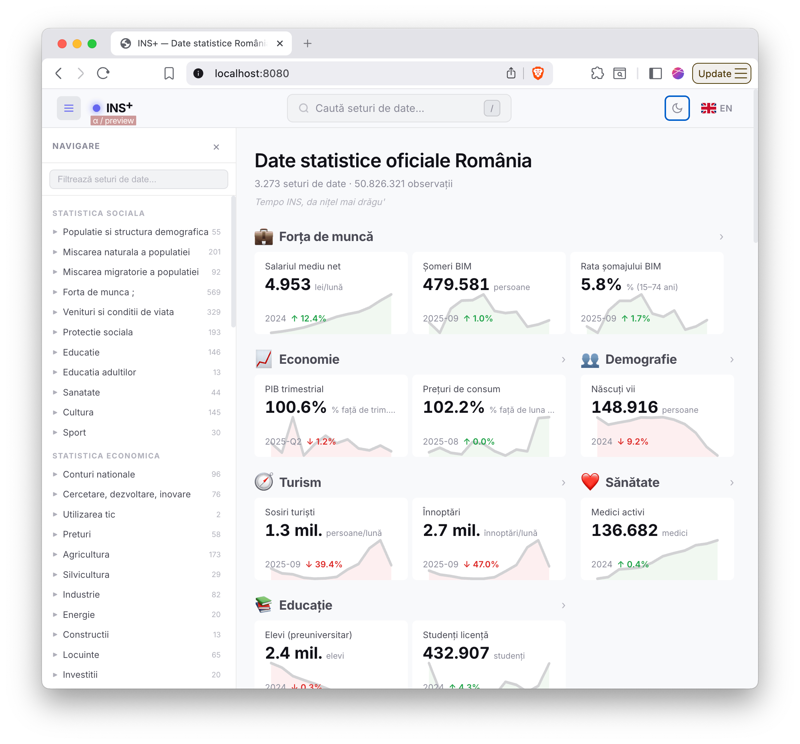

[ins.gov2.ro](https://ins.gov2.ro/) — descarcă, normalizează + UI/navigator pentru datele oferite de Institutul național de statistică, via _TEMPO-Online_ ([statistici.insse.ro](http://statistici.insse.ro:8077/tempo-online))

_INS Tempo Online but make it nice._




📋 [Backlog](docs/backlog.md) · 📅 [Activity History](docs/activity-history.md)

-----

## Running

| What | Command | URL |
|---|---|---|
| **Main app** (FastAPI + DuckDB) | `uvicorn app.main:app --reload --port 8080` | http://localhost:8080 |
| Static UI explorers | `python -m http.server 8000` | http://localhost:8000/ui/dataset-navigator.html |
| StatExplorer (alt) | `uvicorn explorer.main:app --reload --port 8081` | http://localhost:8081 |
| DuckDB browser | `python duckdb-browser.py` | http://localhost:5000 |

Activate venv first: `source ~/devbox/envs/240826/bin/activate`

## Web Application (`app/`)

FastAPI backend with DuckDB + Parquet, Vanilla JS + ECharts frontend.

```
app/
  main.py             — FastAPI entry, mounts API routers + static files
  config.py           — DB_PATH, PARQUET_DIR (v3), MAX_DATA_ROWS=50000
  db.py               — DuckDB cursor-per-request (concurrency-safe)
  routers/            — /api/categories, /api/datasets, /api/datasets/{id}/data, /api/datasets/{id}/download, /sdmx/
```

#### SDMX 2.1 REST API

The app exposes a minimal SDMX 2.1 REST API (agency `INS`) compatible with sdmxthon and the SDMX Dashboard Generator:

| Endpoint | Description |
|---|---|
| `GET /sdmx/2.1/data/INS,{flow}/{key}` | GenericData XML — dot-notation key, `+` OR separator, `startPeriod`/`endPeriod`/`lastNObservations` query params |
| `GET /sdmx/2.1/datastructure/INS/{flow}/1.0` | DataStructure Definition (DSD) XML with codelists |
| `GET /sdmx/2.1/dataflow/INS/{flow}/1.0` | Dataflow definition XML |

Example: `/sdmx/2.1/data/INS,ACC102B/..` returns all observations for dataset `ACC102B`.

```
  services/           — chart_config, chart_selector, query_builder
  static/js/          — dataset-page, chart-factory, chart-geo, chart-demographic, filter-panel
  static/css/         — dataset.css, datasets.css, main.css
  static/geo/         — romania-counties/regions/macroregions.geojson
```

### StatExplorer (`explorer/`)

Alternative Tableau-inspired explorer with i18n and component-based JS architecture.

```
explorer/
  main.py             — FastAPI ("StatExplorer")
  services/           — chart_selector, query_builder, translations
  static/js/charts/   — bar, geo, line, heatmap, pyramid, bubble, small-multiples, table
  static/js/components/ — ChartCanvas, DatasetPicker, FilterBar, LeftSidebar, TopNav
  static/js/lib/      — api, i18n, utils
```

## Pipeline Scripts

Sequential data pipeline — run in order. All scripts accept `--lang ro|en` (default: `ro`).

| Script | Output | Description |
|---|---|---|
| `1-fetch-context.py` | `data/1-indexes/{lang}/context.csv` | Fetches category/context hierarchy from TEMPO API |
| `2-fetch-matrices.py` | `data/1-indexes/{lang}/matrices.csv` | Fetches dataset list from TEMPO API |
| `3-fetch-metas.py` | `data/2-metas/{lang}/{id}.json` | Downloads JSON metadata for each dataset |
| `4-build-meta-index.py` | `data/1-indexes/{lang}/matrices-list.csv` | Builds summary index from metadata JSONs |
| `5-varstats-db.py` | `data/3-db/{lang}/tempo-indexes.db` | Creates SQLite DB from metadata |
| `6-fetch-csv.py` | `data/4-datasets/{lang}/` | Downloads raw CSV data files from TEMPO API |
| `7-data-compactor.py` | `data/5-compact-datasets/{lang}/` | Replaces text labels with numeric IDs in CSVs |
| `8-setup-duckdb-schema.py` | `data/tempo_metadata.duckdb` | Creates DuckDB schema (contexts, matrices, dimensions) |
| `9-csv-to-parquet.py` | `data/parquet/ro/` | Converts compacted CSVs to Parquet |
| `10-import-metadata.py` | DuckDB tables | Imports all metadata into DuckDB |
| `10-classify-dimensions.py` | `dimension_options_parsed`, `matrix_profiles` | Parses/classifies dimension options, detects archetypes |
| `10-sdmx-export.py` | `data/6-sdmx-csv/ro/` | Converts compacted CSVs to SDMX-CSV 2.0 |
| `11-build-sdmx-codes.py` | DuckDB code mapping tables | Builds SDMX code mappings in DuckDB |
| `11-coverage-profiler.py` | `dataset_coverage` DuckDB table | Analyzes data completeness per dataset |
| `12-parquet-to-sdmx.py` | `data/parquet-v3/ro/` | Transforms parquet-v2 to SDMX-native parquet-v3 |
| `12-split-datasets.py` | `data/parquet-v3/ro/` | Splits inconsistent datasets into clean sub-datasets |

### Other root-level scripts

| Script | Description |
|---|---|
| `generate_view_profiles.py` | Generates per-dataset JSON view profiles → `data/view-profiles/` |
| `build-geo-regions.py` | Dissolves county GeoJSON into regions + macroregions |
| `split_rules.py` | Split rules engine — classifies datasets needing structural splits |
| `detect_trends.py` | Detects trends, YoY growth, seasonality → `dataset_trends` DuckDB table |
| `duckdb_config.py` | Central config: paths for all DuckDB/Parquet processing |
| `duckdb-browser.py` | Flask browser for exploring DuckDB + Parquet data |
| `build-dataset-metadata.py` | Scans CSVs, calculates stats → `ui/data/dataset-metadata.json` |
| `get-news.py` | Scrapes INS news/press releases → `data/insse_news.csv` |
| `test_chart_selector.py` | Tests chart selection engine across all datasets |

## utils/

| Script | Description |
|---|---|
| `14-parquet-to-ids.py` | Converts Parquet from text labels → numeric IDs → `data/parquet-v2/ro/` |
| `13-slim-samples-to-markdown.py` | Converts slim-sample CSVs to markdown for LLM analysis |
| `12-csv-headers-index.py` | Extracts headers from all CSVs → `data/2-metas/csv-headers-index.csv` |
| `11-slim-samples.py` | Samples up to 100 rows per dataset → `data/4-datasets-slim-samples/` |
| `build-dimension-index.py` | Builds searchable SQLite index from metadata JSONs |
| `build-enhanced-navigator-index.py` | Builds optimized SQLite + JSON indexes for the dataset navigator UI |
| `build-static-index.py` | Generates static JSON indexes for client-side explorer |
| `query-dimensions.py` | CLI query tool for the dimension index SQLite DB |
| `query-duckdb.py` | Query helper for DuckDB + Parquet |
| `explore-data.py` | Exploration script showing DuckDB + Parquet integration patterns |
| `export-db-to-json.py` | Exports dimension index SQLite → `ui/data/dimension_index.json` |
| `check-meta-consistency.py` | Validates consistency between metadata directories |

## profiling/

| Script | Description |
|---|---|
| `data_profiler.py` | Main profiler: validates CSV structure, classifies column types, generates reports |
| `variable_classifier.py` | Classifies variable labels using a CSV ruleset |
| `unit_classifier.py` | Classifies unit-of-measure labels semantically |
| `validation_rules.py` | Modular validation framework (column names, data content, file structure) |
| `build_indexes.py` | Builds keyword/theme indexes from datasets → `data/indexes/` |
| `tool-list-headers.py` | Extracts CSV headers → `data/2-csv-cols/ro/` |
| `tool-sample-csvs.py` | Creates sampled CSVs (first/mid/last 5 rows) → `data/datasets-samples/ro/` |
| `tool-word-frequency.py` | Romanian word frequency analysis of dataset titles |

## Data

```
data/
  1-indexes/{lang}/        context.csv, matrices.csv
  2-metas/{lang}/          {dataset-id}.json — metadata per dataset
  3-db/{lang}/             tempo-indexes.db (SQLite, legacy)
  4-datasets/{lang}/       raw CSVs from TEMPO API
  4-datasets-slim-samples/ 50/ and 100/ row samples for LLM analysis
  5-compact-datasets/      CSVs with numeric IDs instead of labels
  6-sdmx-csv/ro/           SDMX-CSV 2.0 output
  corpus/
    parquet/             Canonical SDMX parquet files — 3,632 files ← used by app
    metadata.duckdb      Main DuckDB metadata (16 tables)
    view-profiles/       Per-dataset JSON view profiles — ~3,800 files
  parquet-v2/ro/           Parquet v2 (numeric IDs) — legacy fallback
  meta/                    Reference data (judet CSVs, SIRUTA)
  logs/                    Pipeline execution logs
```

Historical data snapshots in `data-old/`, `data-25-1/`, `data-2026/`.

## Deployment

- **Dockerfile** + **fly.toml** — Fly.io deployment (shared-cpu-1x, 512MB, Amsterdam region)
- `scripts/prepare-deploy-data.sh` — Stages parquet-v3 + v2 fallbacks + DuckDB + view-profiles into `deploy-data/`
- `deploy/oracle/` — Oracle Cloud deployment (systemd + nginx)
- `deploy/hf-spaces/` — Hugging Face Spaces deployment


## Roadmap

### Done
- [x] Fetch index, download CSVs, compact data
- [x] Import into DuckDB + Parquet (v1 → v2 → v3)
- [x] Fetch english labels (bilingual support)
- [x] FastAPI backend (`app/`) with DuckDB + Parquet
- [x] Chart framework (archetypes: geo_time, demographic, time_residence, time_series)
- [x] Choropleth map, demographic grouped bar, line charts
- [x] Dataset splitting (by county, age groups, multi-UM)
- [x] View profiles (3,883 JSON configs)
- [x] SDMX code mappings + parquet-v3 conversion
- [x] Deployment setup (Fly.io, Oracle, HF Spaces)
- [x] Define charting rules + JSON chart profiles per dataset
- [x] Filter datasets by dimension, context info, permalinks
- [x] 30k cells limit handling in fetch

### Current
- [ ] UI polish — responsive layout, chart label truncation
- [ ] URL state persistence (filters, period, chart type in URL)
- [ ] Monthly → yearly aggregation toggle

### Later
- [ ] SDMX generic UI framework (multi-source: Eurostat, OECD)
- [ ] NL2SQL natural language queries
- [ ] Notebook-ready exports, publish to Kaggle
- [ ] Basic stats/charts per localități (normalize to population)
- [ ] Static site migration (DuckDB-WASM, Cloudflare Pages)

~see also: [ui/readme.md](ui/readme.md)~
 
## Notes

Kill process for 5050

  lsof -i :5050 | grep -v COMMAND | awk '{print $2}' | xargs kill -9 2>/dev/null && echo "Killed process on port 5050" || echo "No process found on port 5050"

> Atentie! Nomenclatoarele care prezinta doar optiunea "Total" se vor completa automat cu alte optiuni doar daca nomenclatorului anterior i se deselecteaza optiunea "Total" si i se alege o singura alta optiune,

> Important! Unitatile de masura sunt implicit selectate toate pentru a preveni rezultate goale atunci cand se combina cereri incompatibile (spre exemplu, s-ar putea selecta productia de porumb in litri; sau o valoare in ROL dupa denominarea din 2005, etc.).

---

## docs/ Summary

### Core Architecture
- **[DUCKDB_SPECS.md](docs/DUCKDB_SPECS.md)** — Schema design for the DuckDB + Parquet hybrid: tables, file structure, query examples. The canonical DB spec.
- **[DUCKDB_GUIDE.md](docs/DUCKDB_GUIDE.md)** — Practical query patterns and performance tips for DuckDB + Parquet usage.
- **[classify-dimensions.md](docs/classify-dimensions.md)** — Spec for dimension classification/normalization: semantic types, parsing rules, archetype detection.

### Application Specs
- **[app-spec.md](docs/app-spec.md)** — Full v1 spec: FastAPI + DuckDB backend, ECharts frontend, all phases from data prep to UI polish.
- **[app-spec-v2.md](docs/app-spec-v2.md)** — v2 redesign spec. Discovery-first approach leveraging enriched metadata (tags, trends, relationships, chart recommendations).
- **[chart-framework-spec.md](docs/chart-framework-spec.md)** — Generic chart selection engine: 15 chart types, dimension role assignment, filter system.

### Data & Profiling
- **[data analysis.md](docs/data%20analysis.md)** — Framework for systematic profiling, classification, and dashboard generation.
- **[data notes.md](docs/data%20notes.md)** — Raw notes on data quirks, dimension patterns, edge cases.
- **[TODO_COMPACTION.md](docs/TODO_COMPACTION.md)** — Known issues with CSV compaction and label normalization fixes.
- **[PROFILING_AND_EXPLORER.md](docs/PROFILING_AND_EXPLORER.md)** — Guide to the CSV profiler and Explorer UI: output paths, validation flags, API endpoints.

### UI / Legacy
- **[STATIC-CONVERSION-SUMMARY.md](docs/STATIC-CONVERSION-SUMMARY.md)** — Documents conversion from server-based to static site explorer.
- **[STATIC-VS-PYTHON-COMPARISON.md](docs/STATIC-VS-PYTHON-COMPARISON.md)** — Test results showing 100% feature parity between Python and static versions.
- **[JUDET-SPLIT-IMPLEMENTATION.md](docs/JUDET-SPLIT-IMPLEMENTATION.md)** — How large datasets are split by county (judet) to stay under the 30k-cell API limit.

### Deployment
- **[DEPLOY-DREAMHOST.md](docs/DEPLOY-DREAMHOST.md)** — Deployment guide for shared hosting via Passenger WSGI.

### Agents Pipeline (`docs/agents/`)
- **[README.md](docs/agents/README.md)** — Overview of the 6-agent enrichment pipeline (produces value_profiles, coverage, trends, tags, relationships, chart_recs).
- **[pipeline.md](docs/agents/pipeline.md)** — Orchestration: 3 phases, 7 agents, execution order and verification steps.
- **phase1-value-profiler.md** — Agent 1A: min/max/mean/percentiles/distribution per dataset.
- **phase1-coverage-profiler.md** — Agent 1B: time/geo coverage, fill rate, sparsity.
- **phase1-trend-detector.md** — Agent 1C: trend direction, YoY growth, seasonality, breakpoints.
- **phase2-topic-tagger.md** — Agent 2A: bilingual semantic tags from context + dataset names.
- **phase2-dimension-overlap.md** — Agent 2B: related-dataset discovery via dimension fingerprints.
- **phase2-chart-recommender.md** — Agent 2C: data-driven chart type recommendations.
- **phase3-ia-designer.md** — Agent 3A: generates the full information architecture spec from enriched metadata.
